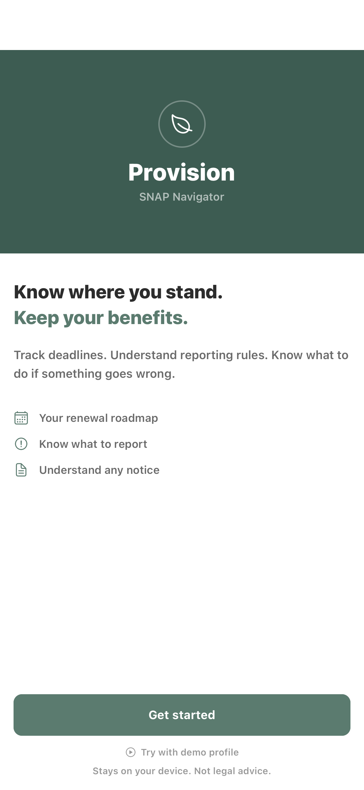
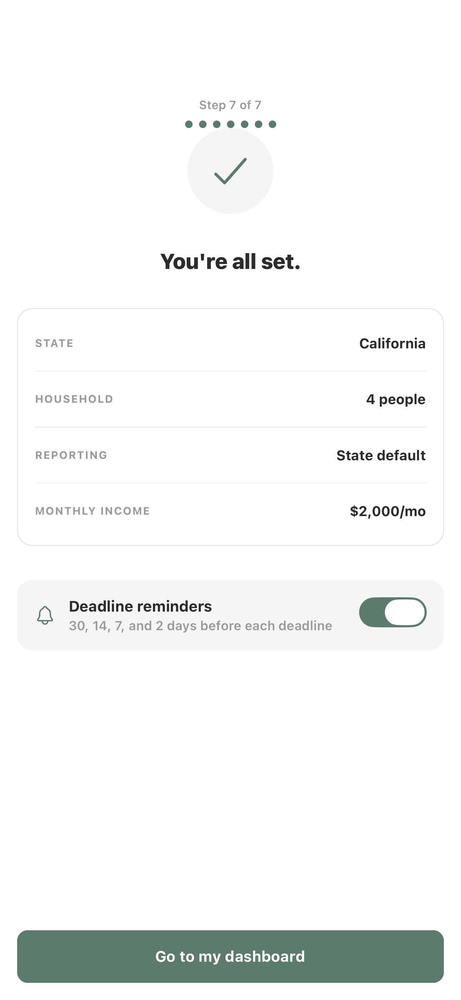
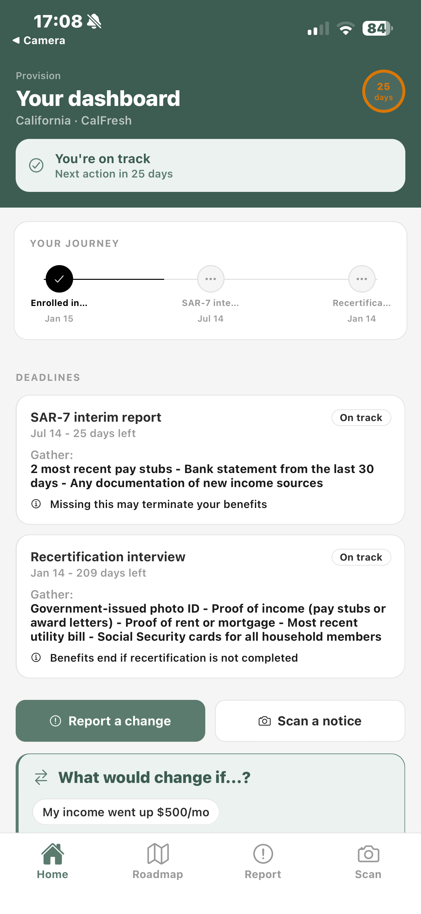
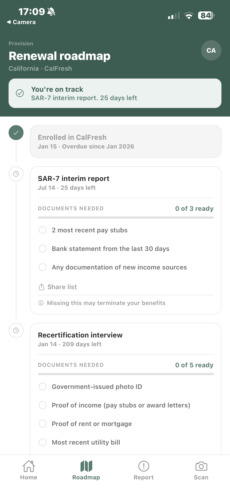
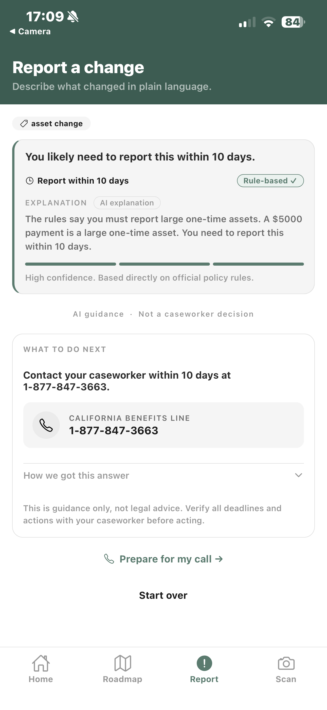
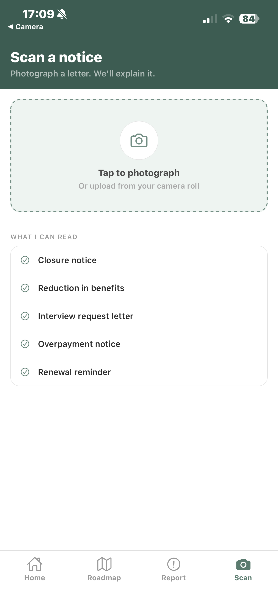

# Provision

SNAP benefits navigator built for the USAII Global AI Hackathon 2026, Undergraduate Track, Challenge 4: Fix Systems People Depend On.

Provision helps SNAP recipients move from confusion to action. It turns reporting rules, notices, deadlines, and recovery steps into plain-language guidance backed by policy snippets and deterministic rules.

## Live Access

- Android app: [Install Provision APK](https://expo.dev/accounts/syedahmedkhaderi/projects/provision/builds/766bc1d4-7cc8-4666-8080-54910f524538)
- Backend API: [Render deployment](https://provision-usaii-hackathon-fdys.onrender.com/health)
- iPhone note: iOS is not distributed yet. Use the screenshot walkthrough below unless TestFlight is added later.

<p align="center">
  <a href="https://expo.dev/accounts/syedahmedkhaderi/projects/provision/builds/766bc1d4-7cc8-4666-8080-54910f524538">
    
  </a>
</p>

<p align="center"><strong>Scan to install the Android build</strong></p>

## Judge Snapshot

| Dimension | How Provision Addresses It |
|---|---|
| Problem Understanding | Focuses on a concrete user problem: missing SNAP deadlines, misunderstanding notices, and losing benefits for procedural reasons |
| AI Reasoning | Uses Gemini for interpretation and explanation where rules alone are not enough, while keeping all hard thresholds deterministic |
| Solution Design | End-to-end flow from onboarding → deadline roadmap → change reporting → notice interpretation → recovery steps |
| Impact & Insight | Reduces friction in a system where small reporting mistakes can cause benefit disruption |
| Responsible AI | Includes citations, disclaimers, deterministic guardrails, caseworker escalation, and graceful fallback behavior |

## Problem

SNAP recipients often lose benefits not because they are ineligible, but because the system is hard to navigate:

- reporting rules vary by state
- notices are dense and difficult to interpret
- deadlines are easy to miss
- users do not know what change matters, what to upload, or who to call next

For this demo, Provision focuses on California and Texas, two states with different reporting models.

## Why AI Here

A rules engine is good at dates, thresholds, deadlines, and state-specific policy logic. It is not good at translating a real person's messy description into a useful next step.

Provision combines both:

- `rules_engine.py` owns hard numbers and deterministic compliance logic
- Gemini translates plain-language changes and notices into understandable explanations
- the backend merges them so the model never invents deadlines or thresholds

This matches the USAII challenge lens: AI is used where interpretation reduces friction, not where a fixed rule should make the decision.

## End-to-End User Journey

1. A user sets their state, household size, reporting type, and recent changes.
2. Provision builds a state-aware renewal roadmap with deadlines and required documents.
3. The user describes a life change in plain language, such as starting a new part-time job.
4. Provision explains whether that change likely needs reporting, when to act, and who to call.
5. The user photographs a SNAP notice and gets a plain-language explanation plus next options.
6. If something already went wrong, Provision provides recovery steps and a fair-hearing template.

## What It Does

- Onboarding flow tailored to SNAP reporting context
- Deadline roadmap with document checklists
- "Report a change" plain-language interpretation
- "Scan a notice" notice explanation from photo or text
- Recovery guidance when benefits are reduced or at risk
- Deterministic eligibility simulation for scenario planning

## Product Gallery

<p align="center">
  
  
  
</p>

<p align="center">
  
  
  
</p>

## Architecture

```text
Expo / React Native app
        |
        | HTTPS JSON
        v
FastAPI backend
  |- rules_engine.py      deterministic deadlines, thresholds, roadmaps
  |- knowledge_base.py    state policy snippets and retrieval
  |- llm_client.py        Gemini API calls, key rotation, cache, backoff
  |- prompts.py           structured prompts for each task
  |- main.py              API routes and deterministic/AI merge logic
        |
        v
Google Gemini
```

## Responsible AI

- Deterministic-first: deadlines and policy thresholds come from code, not the model
- Retrieval-bounded prompting: Gemini only receives state-specific policy snippets
- Plain-language guidance: responses are written for comprehension, not legal precision
- Safe fallback: if AI is unavailable, the app still returns a deterministic answer instead of crashing
- Human escalation: caseworker contact is always available for high-risk or uncertain cases
- Transparency: responses include citations and a disclaimer that the app is guidance, not legal advice

**Graceful degradation** — every AI route returns a safe deterministic answer if all Gemini keys are exhausted. The app never crashes mid-demo.

---

## Stack

- **Frontend**: Expo SDK 54, React Native 0.81, expo-router v6, TypeScript 5.8
- **Backend**: FastAPI, Python 3.10+, httpx, pydantic, python-dotenv
- **AI**: Google Gemini 2.5 Flash — multi-key rotation, SHA-256 prompt cache, 10-minute backoff

---

## Repo layout

```
provision-usaii-hackathon/
├── setup.sh              one-time setup (venv, npm install, .env files)
├── start.sh              start backend + Expo together
├── backend/
│   ├── main.py           FastAPI routes + AI/rules merge logic
│   ├── rules_engine.py   deterministic FPL tables and business rules
│   ├── knowledge_base.py CA/TX policy snippets + keyword retrieval
│   ├── schemas.py        Pydantic request models
│   ├── llm_client.py     Gemini rotator + JSON helper
│   ├── prompts.py        system prompts
│   ├── requirements.txt
│   ├── .env              create via setup.sh (never committed)
│   └── .env.example      template
└── frontend/
    ├── app/              expo-router screens
    │   ├── (tabs)/       home, roadmap, report, scan
    │   ├── onboarding/   7-step onboarding flow
    │   └── recovery.tsx  recovery modal
    ├── components/       UI components
    ├── services/         apiClient, llmService, snapEngine, storageService
    ├── constants/        colors, typography, spacing, snapRules
    ├── context/          UserContext (AsyncStorage)
    ├── types/            TypeScript interfaces
    ├── .env              create via setup.sh (never committed)
    └── .env.example      template
```

---

## Getting started

### Prerequisites

- Python 3.10+
- Node 18+
- [Expo Go](https://expo.dev/go) installed on your phone for local testing
- At least one [Google Gemini API key](https://aistudio.google.com/app/apikey) (free tier works)

### 1 — Setup (run once)

```bash
bash setup.sh
```

This creates the Python venv, installs all dependencies, and writes `frontend/.env` with your machine's LAN IP so Expo Go can reach the backend during local development.

Then open `backend/.env` and paste in your Gemini key(s):

```
GEMINI_API_KEYS=***
GEMINI_MODEL=gemini-3.1-flash-lite
```

### 2 — Start locally

```bash
bash start.sh
```

Boots the backend on `:8000` and launches Expo in the same terminal. Scan the QR code with **Expo Go** — phone and laptop must be on the same Wi-Fi.

Press `q` or Ctrl+C to stop both.

### 3 — Smoke test the backend

```bash
curl http://localhost:8000/health
# {"status":"ok","gemini_available":true}

# Get demo personas for testing
curl http://localhost:8000/demo/scenarios
```

---

## Testing

The backend has **127 automated tests** covering rules engine, API contracts, domain accuracy, and security:

```bash
cd backend
source .venv/bin/activate   # or .venv\Scripts\activate on Windows
python -m pytest tests/ -v
```

Test layers:
- **test_rules_engine.py** (44 tests) — eligibility, classification, roadmap, recovery, date math
- **test_api.py** (37 tests) — all routes with valid/invalid/hostile payloads, Gemini mocked
- **test_domain_accuracy.py** (26 tests) — SNAP thresholds verified against USDA FY2026 source-of-truth
- **test_security.py** (12 tests) — CORS, secret leakage, prompt injection, oversized payloads
- **test_rules_engine.py** (8 tests) — household size boundaries, date clamping, recovery state branching

Every SNAP income threshold, benefit amount, and deadline is verified against USDA FNS FY2026 published values.

---

## Deployment

Provision is deployed as two separate surfaces:

- Backend on Render using the root `Dockerfile`
- Android app built with Expo EAS and distributed through the hosted build link above

### Backend

- URL: `https://provision-usaii-hackathon-fdys.onrender.com`
- Health check: `/health`
- Note: `GET /` returns `{"detail":"Not Found"}` because the backend does not define a root route

Required backend env vars:

```env
GEMINI_API_KEYS=***
GEMINI_MODEL=gemini-3.1-flash-lite
```

### Frontend

`frontend/.env` must point to the public backend:

```env
EXPO_PUBLIC_API_BASE_URL=https://provision-usaii-hackathon-fdys.onrender.com
```

### Android Build

Expo EAS configuration lives in `frontend/eas.json`.

```bash
cd frontend
npx eas-cli login
npx eas-cli build:configure
npx eas-cli build --platform android --profile preview
```

The `preview` profile produces an installable APK and a shareable Expo build URL.

## Local Development

### Prerequisites

- Python 3.10+
- Node 18+
- Expo Go for local device testing
- At least one Gemini API key

### Setup

```bash
bash setup.sh
```

Then edit `backend/.env`:

```env
GEMINI_API_KEYS=***
GEMINI_MODEL=gemini-3.1-flash-lite
```

### Run locally

```bash
bash start.sh
```

Smoke test:

```bash
curl http://localhost:8000/health
```

## Repository Layout

```text
provision-usaii-hackathon/
├── backend/
│   ├── main.py
│   ├── llm_client.py
│   ├── rules_engine.py
│   ├── knowledge_base.py
│   ├── prompts.py
│   └── tests/
├── frontend/
│   ├── app/
│   ├── components/
│   ├── services/
│   ├── constants/
│   ├── context/
│   ├── app.json
│   └── eas.json
├── docs/
│   ├── assets/
│   └── screenshots/
├── Dockerfile
├── setup.sh
└── start.sh
```

## Demo Scope

- States: California and Texas
- User goal: keep SNAP benefits by understanding reporting rules, deadlines, and notices
- Demo output: clear next step, timeline, and escalation path

## Disclosure

This project uses rule-based logic plus Google Gemini for interpretation tasks. It is a prototype for hackathon judging, not a production legal or eligibility system.
